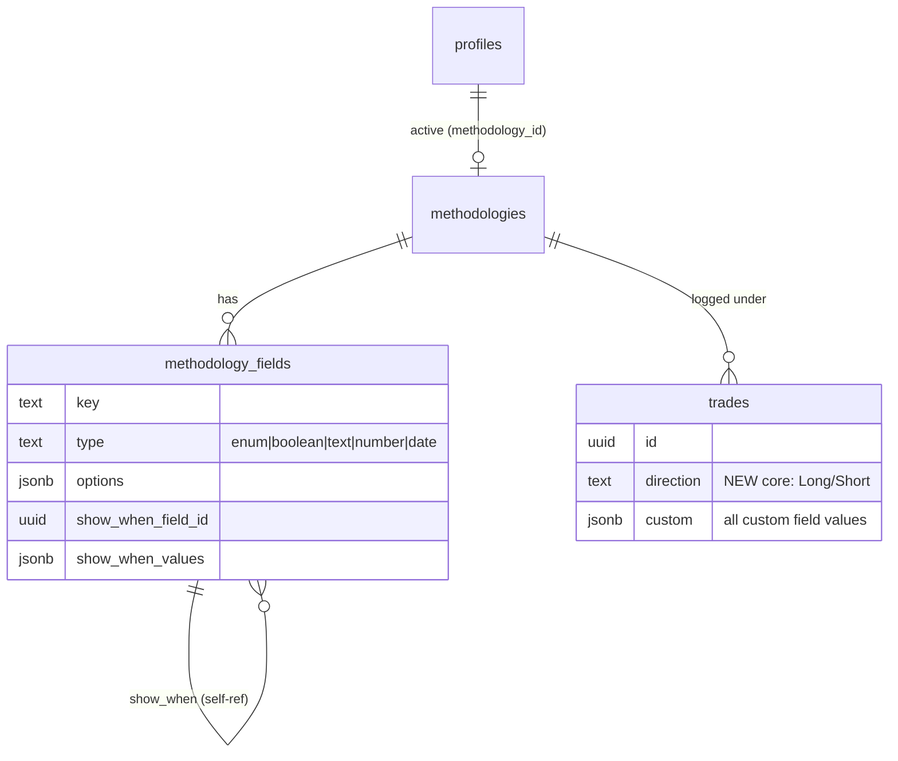

# Beyen — Ontwerp: configureerbaar journal (universele kern + custom velden)

> Status: **ontwerp** (nog niet gebouwd). Branch `fase-3-config-methodiek`.
> Voortbouwend op cyclus 0 (datamodel + Archer-seed + backfill) en 1a (form/filter lezen fases uit de methodiek).
> Dit document is de blauwdruk die de bouw-cycli stuurt. Beslissingen staan expliciet gemarkeerd; open keuzes onderaan.

---

## 1. Positionering & principes

**Doel:** Beyen tot een premium journal maken waar *elke* trader — scalper, daytrader, swingtrader, forex, aandelen, crypto, futures — zijn eigen methodiek en velden definieert, in plaats van vast te zitten aan één ingebakken systeem (het probleem met TradesViz/Tradervue/Edgewise: rigide velden).

**Kernprincipes (leidend voor elke ontwerpkeuze):**

1. **Universele kern is vast, de rest is van de gebruiker.** Een kleine set velden geldt voor iedereen (datum, instrument, richting, uitkomst, resultaat, risico, notities, screenshots). Alles daarbuiten is per-user gedefinieerd.
2. **Archer is één preset, niet de norm.** De 4-fasen-ruggengraat wordt één van vele startsjablonen. De app is nu "verkeerd-om" rond die ~0,5% gebouwd; dit ontwerp draait dat om.
3. **Fase = gewoon een veld.** Er is geen speciaal "fase"-concept meer in de kern. "Fase" is een custom keuzelijst-veld zoals elk ander. Dat collapse't cyclus-0's `methodology_fases` + `methodology_fields` naar één generieke veldtabel.
4. **Non-intrusief, altijd.** Zoals elke eerdere fase: de owner (Archer-data) blijft de hele rit door exact werken. Geen enkele cyclus mag bestaand gedrag breken; kolommen worden pas gedropt als alles gemigreerd én geverifieerd is.
5. **De analyse-motor moet op elk user-veld kunnen uitsplitsen.** Dit is de crux — en het goede nieuws: `breakdownBy()` is al generiek (§4).
6. **Freemium is de businesslaag, niet een bouwlaag.** Het model is volledig configureerbaar; `profiles.plan` bepaalt alleen *hoeveel* een user mag configureren (§7). Zo ligt de premium-waarde in de configuratie zelf.

---

## 2. Domeinmodel (concepten)

### 2.1 Universele kern (vast, real columns op `trades`)

Voor iedereen identiek, nooit configureerbaar, blijven echte kolommen (snel filteren/aggregeren):

| Kern-veld | Nu in DB? | Opmerking |
|---|---|---|
| Datum open / sluiting | ✅ `datum_open`, `datum_sluiting` | ongewijzigd |
| Instrument | ⚠️ alleen forex `pair` enum | **moet verbreden** naar multi-asset (§5) |
| **Richting (Long/Short)** | ❌ bestaat niet | **nieuw kern-veld toevoegen** |
| Uitkomst (Win/Loss/BE) | ✅ `outcome` | ongewijzigd |
| Resultaat | ✅ `resultaat_pct` (%) | R afgeleid; geld-unit = latere cyclus (§6) |
| Risico | ✅ `risk_pct` | ongewijzigd |
| Notities | ✅ `notes` | ongewijzigd |
| Screenshots | ✅ `*_screenshot` (W/D/H4/H2) | tijdframe-gebonden namen zijn Archer-specifiek → generaliseren naar een vrije screenshot-lijst (latere cyclus) |

> **Beslissing:** alle huidige "half-universele" kolommen die eigenlijk Archer-methodiek zijn — `entry`, `trade_concept`, `cc`, `sessie`, `weekly_criteria`, `weekly_kenmerk`, `fase`, alle `fase*_`-kolommen — zijn **géén kern**. Ze worden custom velden (§2.2) en verhuizen naar de `custom`-bag. Voor Archer-users worden ze exact gereproduceerd als velden van de Archer-preset.

### 2.2 Custom velden (per-user gedefinieerd)

Een user bouwt zijn journal uit **custom velden**. Elk veld heeft:

- **key** — stabiele sleutel in de jsonb-bag (bv. `setup`, `sessie`, `fase`)
- **label** — weergavenaam (bv. "Setup", "Sessie")
- **type** — `enum` (keuzelijst) · `boolean` (aan/uit) · `text` (vrije tekst) · `number` (getal) · `date`
- **options** — geordende toegestane waarden (alleen voor `enum`)
- **required** — verplicht bij invoer?
- **group** — sectie-kop in het formulier (bv. "Setup", "Confluenties", "Mindset")
- **conditie** — toon dit veld alleen als een *ander* veld een bepaalde waarde heeft (§2.4)
- **sort_order** — volgorde binnen de groep

### 2.3 Veldtypes → gedrag in filters & analyse

| Type | Formulier | Filter | Uitsplitsbaar in analyse? |
|---|---|---|---|
| `enum` | `<select>` | multi-select chips | ✅ per waarde |
| `boolean` | toggle | Ja/Nee/beide | ✅ Ja vs Nee |
| `number` | number-input | range (min–max) | ✅ via buckets (bv. kwartielen) |
| `date` | date-input | range | ✅ via periode-buckets |
| `text` | textarea | zoek (contains) | ❌ (te vrij om te bucketen) |

### 2.4 Conditionele velden (generalisatie van "fase-kenmerken")

Archer's kenmerken zijn conditioneel: "Structuur" verschijnt alleen bij Fase 2/3, "Engulfing candle?" alleen bij Fase 3. Dat is geen fase-specifiek mechanisme maar een **algemeen** patroon: *toon veld X wanneer veld Y ∈ {…}*.

- `show_when_field_id` → verwijst naar een ander veld (bv. het `fase`-veld)
- `show_when_values` → de waarden die dit veld onthullen (bv. `["Fase 2","Fase 3"]`)

Zo wordt de hele Archer-methodiek exact uitgedrukt zónder speciaal fase-concept:
- `fase` = enum-veld met opties Fase 1..4
- `structuur` = enum-veld, `show_when fase ∈ {Fase 2, Fase 3}`
- `engulfing_candle` = boolean-veld, `show_when fase ∈ {Fase 3}`

> **Beslissing:** het *datamodel* ondersteunt condities vanaf het begin (nodig voor getrouwe Archer-migratie). De *editor-UI* mag condities pas in een latere cyclus blootleggen — tot dan zijn zelf-gemaakte velden altijd zichtbaar en enkel de geseede Archer-preset gebruikt condities.

### 2.5 Presets / templates

Een **preset** is een kant-en-klare set velden. `is_system`-presets zijn world-readable en onbewerkbaar; bij "kiezen" wordt een **eigen kopie geforkt** (fork-on-choose), zodat de user 'm daarna vrij aanpast.

**De concrete preset-inhoud (asset-velden × stijl-velden + recepten-catalogus) is uitgewerkt in [journal-presets.md](journal-presets.md)** — de seed-bron voor cyclus 6, onderbouwd met research. Kort: een user kiest bij onboarding één **recept** (bv. "Futures — Day trader", "Stocks — Swing", "Archer (Forex)", "Blanco"); dat combineert een asset-preset (instrument + sizing + asset-velden) met een stijl-preset (setup/kwaliteit/emotie/beheer). Blanco = enkel de kern.

### 2.6 Meerdere journals — de container voor scheiding per asset class

**Probleem:** forex-, aandelen- en crypto-cijfers mogen nooit vermengen. Een win-rate of equity-curve over EURUSD + AAPL + BTC is betekenisloos (ander kapitaal, andere risico-eenheid: pips/lots vs shares vs notional, andere methodiek). Maar drie hardgecodeerde asset-class-silo's herintroduceren precies de rigiditeit die we ontvluchten (futures? opties? indices? alleen goud?), en forceren de trader die één methodiek over meerdere assets voert tot een onnodige splitsing.

**Oplossing — "journal" wordt een first-class container waarvan een user er 1..n heeft.** Elk journal bezit:
- zijn eigen **methodiek** (veldenset uit §2.2) — dus methodiek verhuist van per-user naar per-journal;
- zijn eigen **instrument-universum** (§5) — forex-pairs, of tickers, of coins;
- zijn eigen **geïsoleerde analyse** — eigen equity-curve, win-rate, breakdowns.

**Asset class = het preset dat je kiest bij "nieuw journal", niet het schema.** "Forex / Stocks / Crypto / Futures / Custom" seeden het juiste instrument-type, starter-velden en risico-rekenwijze. Zo blijft het model open (elk nieuw asset-type = een nieuw preset, geen migratie).

**Futures is een eigen asset class, niet onder stocks.** De asset class bepaalt instrument-eenheid + sizing:

| Asset class | Instrument | Eenheid / sizing | Asset-tools |
|---|---|---|---|
| Forex | pairs (EURUSD) | lots / pips | lot-calculator, currency-split |
| Futures | contracten (ES, NQ, CL, GC) | contracten / ticks | tick-waarde |
| Stocks | tickers (AAPL) | aandelen | — |
| Crypto | coins (BTC) | coins / USD-notional | 24/7-sessies |

**Twee orthogonale assen.** Asset class (instrument + sizing) staat los van methodiek (velden). Een Forex-journal kan de Archer-velden gebruiken; een Futures-journal een eigen setje. Bij "nieuw journal" kies je dus (1) asset class en (2) een methodiek-template (of blanco). Archer is een methodiek-template die toevallig forex-georiënteerd is. Omdat Beyens kern in **%** rekent, raakt het sizing-verschil vooral de instrument-lijst + welke tools verschijnen — de stats-motor blijft gedeeld.

**Bestaand primitief hergebruiken:** de app isoleert al trades met eigen stats via `backtest_project_id` (`null` = live Journal; gezet = geïsoleerd project). Multi-journal veralgemeent dat patroon naar een `journal_id` op `trades`. `profiles.methodology_id` (één actieve methodiek) → wordt "actief journal".

**Gevolgen voor het datamodel (optie B gekozen — `methodologies` promoveren, §9):**
- `methodologies` krijgt `asset_class` (forex/futures/stock/crypto/custom) + instrument-config → het *is* het journal. Geen aparte `journals`-tabel; elk boek bezit zijn eigen velden (geen co-editen over boeken).
- `trades.methodology_id` wordt de facto het `journal_id` (welk boek). `profiles.methodology_id` = actief journal.
- Backtest-projecten blijven een orthogonale as (analyse-modus binnen een journal), niet samengevoegd.
- Filters/analyse scopen **altijd binnen het actieve journal**. Geen enkele stat mengt over journals.

**Beslist (§8/§9):** accounts zijn asset-neutraal en journal-gescoped (propfirms zijn niet altijd forex — futures-prop is een grote categorie); reviews volgen het journal. Nog open: cross-journal overzicht (geblende top-level P&L) — ja/nee?

---

## 3. Datamodel

### 3.1 Hoe cyclus 0 verbreedt

Cyclus 0 gaf ons `methodologies` / `methodology_fases` / `methodology_fields` + `trades.methodology_id` + `trades.kenmerken`. Het ontwerp **verbreedt** dat:

- `methodologies` → **promoveert tot journal** (optie B): krijgt `asset_class` + instrument-config erbij. Het is voortaan het boek én de veldenset in één. `profiles.methodology_id` = actief journal.
- `methodology_fases` → **verdwijnt als apart concept.** Fase wordt een rij in de veldtabel (type `enum`). De fase-*volgorde* wordt de `options`-volgorde van dat veld.
- `methodology_fields` → **generaliseert** van "kenmerk van een fase" naar "elk custom veld". `fase_id` (verplichte FK naar een fase) vervalt; in de plaats komen `type`, `group`, `required`, `show_when_field_id`, `show_when_values`.
- `trades.kenmerken` (jsonb) → **hernoemd naar `trades.custom`** (jsonb): één bag met álle custom-veldwaarden, gekeyed op `field.key`.

### 3.2 Doeltabellen (na verbreding)

```
methodologies            -- gepromoveerd tot "journal": methodiek + boek in één
  id, user_id, naam, is_system, is_default,
  asset_class    text        -- forex | futures | stock | crypto | custom (NIEUW)
  instrument_config jsonb     -- instrument-universum + sizing-tools per asset (NIEUW)
  created_at, updated_at

methodology_fields       -- verbreed: nu ELK custom veld (fase incl.)
  id, methodology_id,
  key            text        -- stabiele sleutel in trades.custom
  label          text
  type           text        -- enum | boolean | text | number | date
  options        jsonb null  -- geordende waarden voor enum
  required       boolean
  group_label    text null   -- sectie-kop in het formulier
  show_when_field_id  uuid null references methodology_fields(id)
  show_when_values    jsonb null
  sort_order     integer
  unique (methodology_id, key)

trades
  ... kern-kolommen ...
  direction   text          -- NIEUW kern-veld (Long/Short)
  methodology_id uuid        -- welke methodiek deze trade loggde
  custom      jsonb          -- alle custom-veldwaarden (was `kenmerken`)
```



### 3.3 RLS & fork-on-edit

Ongewijzigd t.o.v. cyclus 0: system-presets world-readable/onbewerkbaar; eigen methodieken volledig door de user beheerd (`user_id = auth.uid()`). Bij bewerken van een system-preset: eerst forken naar een eigen kopie, dan `profiles.methodology_id` herpointen.

---

## 4. De crux: custom veld → analyse-motor

Het lastigste stuk uit het geheugen ("moet op willekeurig user-veld kunnen uitsplitsen") is grotendeels **al opgelost door bestaande architectuur**:

- `breakdownBy(trades, keyFn, opts)` in `src/lib/stats/breakdown.ts` is **type-generiek** en neemt een `keyFn`. Elke "Per X"-split is al niks meer dan een andere `keyFn`.
- De brug is dus: **genereer de `keyFn` uit een `MethodologyField`.**

```ts
// schets — leest een custom-veldwaarde uit de bag en levert een breakdown-key
function keyForField(field: MethodologyField) {
  return (t: Trade): string | null => {
    const raw = t.custom[field.key];
    if (raw == null) return null;
    if (field.type === "boolean") return raw ? "Ja" : "Nee";
    if (field.type === "number") return bucketNumber(raw, field); // kwartielen
    return String(raw); // enum/text
  };
}
```

Gevolgen per laag:
- **Overzichts-KPI's** (`computeOverviewKpis`) — ongewijzigd, veld-agnostisch.
- **Breakdowns** — de Backtesting-pagina rendert nu vaste blokken (Per Fase, Per Entry, …). Wordt: `methodology.fields.filter(uitsplitsbaar).map(field => <Breakdown keyFn={keyForField(field)} />)`. Eén `.map()` over de user-velden i.p.v. hand-geschreven blokken.
- **`breakdownByWithFaseSplit`** — de "per fase"-secundaire split wordt "per het-veld-dat-de-user-als-primaire-dimensie-koos" (of blijft optioneel: split tegen elk gekozen enum-veld). `FASES`-hardcode eruit.
- **`sortOrder`** — komt nu uit `field.options` i.p.v. de `FASES`-constante.
- **`isMissed()` / `takenTrades()`** — ongemoeid; "Missed trade" blijft aan `trade_evaluation` hangen (kern-gedrag).

> Dit betekent dat cyclus 4 (analyse config-driven) vooral **bekabeling** is, geen nieuwe rekenlogica.

---

## 5. Instrument-generalisatie (multi-asset)

Vandaag is `pair` een forex-enum + afgeleide `currenciesOfPair()`, `FOREX_PAIRS`, pip/lot-aannames. Voor "alle type traders" (aandelen, crypto, futures) moet instrument vrij worden.

> **Herzien door §2.6:** asset class scheidt niet binnen één journal via een veld, maar **op journal-niveau** (elk journal heeft één asset-class-preset + eigen instrument-universum). Onderstaande instrument-mechanica leeft dus binnen een journal.

**Voorstel (eigen cyclus, want raakt lot-calculator, currency-breakdown, symbol-import):**
- `trades.instrument text` (vrij). De asset class komt van het journal (§2.6), niet van een per-trade-veld.
- Per-journal instrument-lijst (zelfde patroon als `custom_options`): een user cureert zijn eigen tickers/pairs/coins per boek.
- Forex-specifieke afgeleiden (currency-split, lot-size-calculator, XAU/XAG-regels) verschijnen **alleen in een forex-journal** i.p.v. altijd-aan.
- Broker-CSV-import: de symbol-mapper (`symbols.ts`) generaliseert van "→ Pair" naar "→ instrument (+ asset_class)".

> Dit is een grote, op zichzelf staande brok. Kan ná de custom-velden-kern; forex-only blijft intussen gewoon werken.

---

## 6. Resultaat-eenheid (%/R/geld)

Kern-resultaat is nu `resultaat_pct` (%). Veel traders denken in **geld** of **R**. R is al afgeleid (`rMultiple()`). Geld-P&L is er nog niet als primaire.

**Voorstel (eigen, latere cyclus):** een per-user `result_unit` (`percent | R | currency`) op `profiles`. De hele stats-motor rekent intern in % (bewaart de bestaande contracten); de *weergave* converteert. Geld vereist óf een bedrag-per-trade-kolom óf account-saldo-koppeling — dat is de grootste haak. **Bewust uitgesteld** tot de custom-velden-kern staat; niet in de eerste premium-release forceren.

---

## 7. Gefaseerd bouwplan

Elke cyclus is **zelfstandig deploybaar en non-intrusief** (Archer-owner blijft werken). "Klaar" = `npm run lint` + `test` + `build` groen, plus migratie geverifieerd op prod-Supabase.

| Cyclus | Inhoud | DB-migratie? | Risico |
|---|---|---|---|
| **1b** ✳️ | **Model verbreden + journal-fundament (samen).** `methodology_fields` absorbeert fases (type/group/condities); `methodologies` promoveert tot journal (`asset_class` + instrument-config); `trades.kenmerken`→`trades.custom`; `methodology_id` gaat als `journal_id` fungeren + analyse/filters scopen erop. Nieuwe users krijgen een **eigen leeg** journal (geen Archer-default). Owner krijgt één Forex-journal met Archer-velden. | ja (additief) | midden |
| **2** | **Custom-velden-editor** (platte velden) op `/settings`: velden toevoegen/hernoemen/herordenen/verwijderen, type kiezen, opties cureren. Fork-on-edit voor system-presets. | nee | laag |
| **2b** | **Conditie-bouwer** in de editor: "toon veld X als Y ∈ {…}" (`show_when_*`). Fast-follow op 2. | nee | midden |
| **3** | **Trade-formulier dynamisch**: kern-sectie vast + custom-sectie gegenereerd uit de velden (incl. conditionele zichtbaarheid). Schrijft naar `trades.custom`. | nee | midden |
| **3b** | **Journal-switcher-UI** + "nieuw journal" (asset class × methodiek-template). Premium-gated op aantal. | nee | midden |
| **4** | **Filters + analyse config-driven**: `FilterPanel` en Backtesting-breakdowns renderen uit de velden (§4). `breakdownByWithFaseSplit` de-hardcoden. | nee | midden |
| **5** | **Nieuw kern-veld: richting (Long/Short)** + screenshot-lijst generaliseren. | ja (additief) | laag |
| **6** | **Presets-bibliotheek + onboarding**: recepten-catalogus (asset × stijl) uit [journal-presets.md](journal-presets.md) als `is_system`-presets; "kies een recept of start blanco". | ja (seeds) | laag |
| **7** | **Instrument-generalisatie** (multi-asset, §5). | ja | hoog |
| **8** | **Resultaat-eenheid** %/R/geld (§6). | ja | hoog |
| **9** | **Freemium-gate** `profiles.plan` (§7 hieronder). | nee | laag |
| **10** | **Opruiming**: oude `fase*_`, `weekly_*`, `entry`, `trade_concept`, `cc`-kolommen droppen zodra alle data in `custom` zit en niets ze nog leest. | ja (drops) | hoog — pas als alles geverifieerd |

✳️ = deels al gepland in het geheugen; hier verbreed van fase-editor naar generieke veld-editor.

**Migratie van Archer-data (loopt mee in 1b→3):** de cyclus-0-backfill zette kenmerken al in de bag. Aanvullend moeten `entry`/`trade_concept`/`cc`/`sessie`/`weekly_*` als custom velden van de Archer-preset geseed worden en hun kolomwaarden naar `trades.custom` gekopieerd (zelfde `jsonb_strip_nulls`-patroon als 0020). Kolommen pas droppen in cyclus 10.

---

## 8. Freemium / premium-afbakening — **BESLIST 2026-08-09**

Het configureerbare model is de premium-waarde. De grens ligt op **hoeveelheid + customisatie**, niet op functionaliteit — de gratis versie is een compleet werkend journal.

| | **Gratis (basis)** | **Premium (`profiles.plan`)** |
|---|---|---|
| Journals | 1 | meerdere (per asset class) |
| Accounts | 1 | meerdere |
| Velden / methodiek | vast referentiesjabloon, minimaal aanpasbaar | eigen velden + condities + presets forken/delen |
| Instrument | het journal-preset | multi-asset (meerdere journals) |
| Resultaat-eenheid | % | %/R/geld |
| Kern + analyse | volledig | volledig |

> **De snede:** gratis = een volledig werkend journal met **vaste waarden**; je betaalt zodra je het **naar je eigen hand** wil zetten (eigen velden, meerdere boeken/accounts). "Je zit niet vast aan onze methodiek" is letterlijk het betaalargument — precies het gat dat de concurrentie laat liggen.

**Gevolg voor `profiles.plan`-gates:** journal-count (1), account-count (1) en "custom velden bewerken" zijn de drie hendels die op `free` geblokkeerd worden. Alles is technisch aanwezig; de gate is een limiet, geen feature-flag per code-pad.

---

## 9. Open keuzes (jouw beslissing)

**Beslist 2026-08-09:**
- ✅ **Freemium-grens** — zie §8. Gratis = 1 journal / 1 account / vast sjabloon / minimaal customisable; premium = meerdere journals+accounts + volledige customisatie.
- ✅ **Account is asset-neutraal, journal-gescoped.** Propfirms zijn *niet* altijd forex (CFD-firms = multi-asset; futures-propfirms zoals Topstep/Apex = een grote aparte categorie). Het accountmodel (`account_size` + P&L%, `Phase 1/2/Funded/Private`) is al asset-neutraal → een account hoort bij een journal van welk asset-type dan ook, niet vastgeklonken aan forex.
- ✅ **Reviews volgen het journal** (je reviewt een boek). In de gratis 1-journal-modus is dit gedrag identiek aan nu.

**Beslist 2026-08-09 (ronde 2):**
- ✅ **Journal-scheiding vroeg** — samen met methodiek-per-journal invoeren (cyclus 1b), zodat de analyse-motor maar 1× verbouwd wordt.
- ✅ **Journal = `methodologies` promoveren (optie B).** Geen aparte `journals`-tabel: `asset_class` + instrument-config komen op de bestaande `methodologies`-tabel; `trades.methodology_id` wordt de facto `journal_id`. Elk boek bezit zijn eigen velden (geen co-editen over boeken). Minder migratie, bouwt direct op cyclus 0. (Rename van tabel/type naar "journal" voor duidelijkheid is optioneel/cosmetisch.)
- ✅ **`kenmerken` → `custom` hernoemen.**
- ✅ **Condities zo vroeg mogelijk.** Model kan het vanaf dag 1 (Archer-preset toont ze al); platte velden-editor eerst (cyclus 2) zodat die sneller live gaat, conditie-bouwer meteen als fast-follow (cyclus 2b).

**Nog open:**
1. **Cross-journal overzicht?** (§2.6) — (A) volledige isolatie [aanbevolen]; of (B) isolatie + optioneel top-level "alle journals"-rollup. Speelt pas bij premium/multi-journal. Ik raad A eerst aan, B later.
2. **Asset-class-presets bij launch** — Forex/Futures/Stocks/Crypto — met welke starter-velden per stuk?
3. **Methodiek-presets** — welke starters naast Blanco/Archer (Scalper/Daytrader/Swing), met welke velden?

---

## 10. Risico's

- **Gedeelde working tree** — parallelle chats delen deze branch; alleen eigen hunks stagen (`git add -p`). Zie geheugen.
- **Kolommen droppen (cyclus 10)** is onomkeerbaar — pas ná bewezen migratie + backup-branch.
- **Concurrentie** (TradesViz/Tradervue/Edgewise doen custom velden al) — differentiatie moet zitten in de *methodiek-condities* + UX-gemak + presets, niet enkel "je kan velden toevoegen".
- **Scope-creep** — instrument (§5) en resultaat-eenheid (§6) zijn elk zo groot als de custom-velden-kern zelf. Niet samenpakken.
